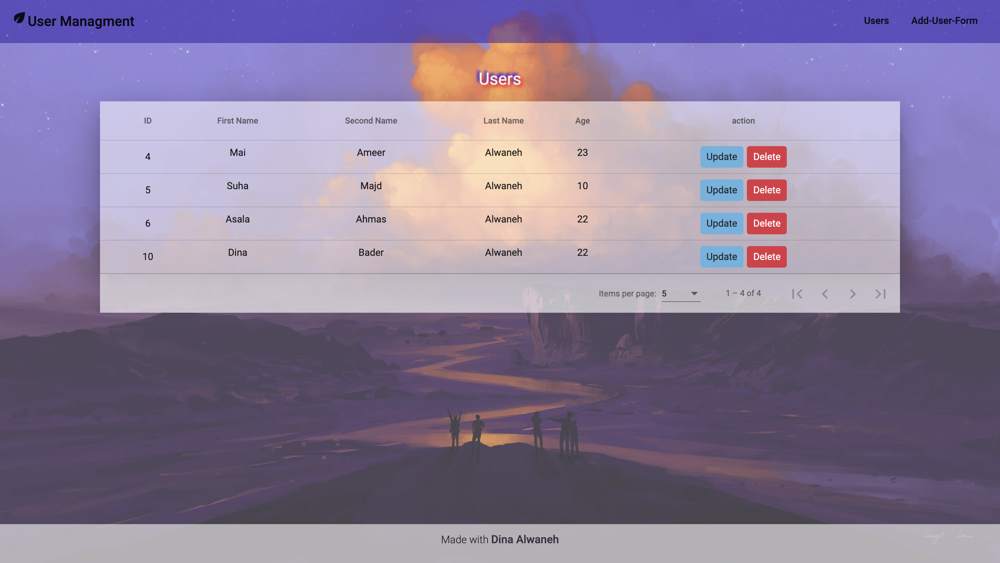

# DynamicDataManagementApp

This project was generated with [Angular CLI](https://github.com/angular/angular-cli) version 14.2.13.

## Current Features

This application currently supports the following features:

1. **Display Users**: View a list of users.
2. **Pagination**: Navigate through users in a paginated format.
3. **Add New User**: Capability to add a new user to the system.
4. **Edit Specific User**: Edit details of a specific user.
5. **Cancel Edit**: Ability to cancel the edit operation.
6. **Delete User**: Remove a user from the system.
7. **IndexedDB for Data Storage**: Utilizes IndexedDB to store data on the client side.

## Future Features

Planned enhancements for the application include:

- **Search Functionality**: Implementing a feature to search through the users.
- **Sort by Age**: Ability to sort users based on their age.

## Implementation Details

Please refer to the following detailed explanation:

[Task Implementation Details](https://drive.google.com/file/d/14-2aRulH8fE_WE2FS47xT9CvNFGgQRN3/view?usp=sharing)

## Development server

Run `ng serve` for a dev server. Navigate to `http://localhost:4200/`. The application will automatically reload if you change any of the source files.

## Build

Run `ng build` to build the project. The build artifacts will be stored in the `dist/` directory.
